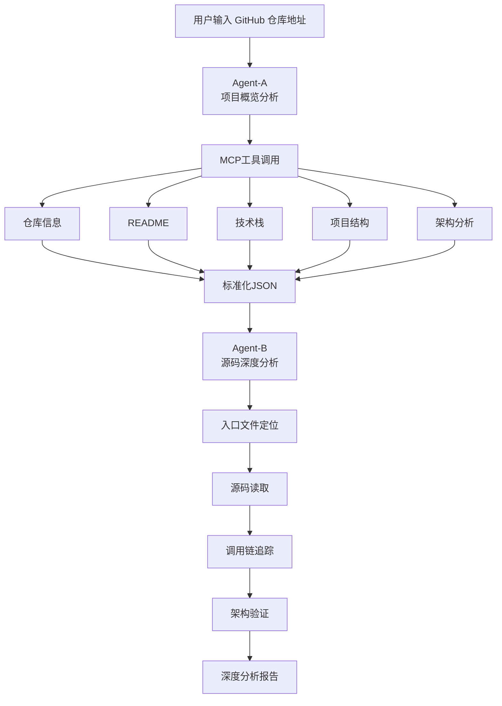

---

# 🚀 GitHub 开源项目深度分析 Agent

## 项目概述

GitHub 开源项目深度分析 Agent 是一个基于 **Nexent + MCP + 多Agent协作** 构建的项目学习助手。

它解决的核心问题是：

> 当开发者第一次接触一个大型开源项目时，
>
> README 看不懂、
>
> 项目结构太复杂、
>
> 不知道从哪里开始读源码、
>
> 更不知道核心调用链在哪里。

系统通过 **双Agent协作机制**，将项目分析拆分为：

* 项目概览分析（Agent-A）
* 源码深度分析（Agent-B）

最终生成一份包含：

* 项目定位
* 技术栈
* 架构设计
* 核心模块
* 入口文件
* 调用链分析
* 源码验证结果

的完整技术报告。

---

## 🎯 项目定位

本项目定位为：

> **开源项目学习与源码分析助手**

帮助开发者在几分钟内完成项目调研工作。

### 系统能做什么

| 能力       | 说明           |
| -------- | ------------ |
| 项目概览分析   | 自动解析仓库信息     |
| README解析 | 提取项目核心功能     |
| 技术栈识别    | 自动识别语言与依赖    |
| 项目结构分析   | 生成目录树        |
| 架构推断     | 判断单体/微服务/插件化 |
| 入口定位     | 自动发现入口文件     |
| 核心模块识别   | 找出关键源码目录     |
| 调用链追踪    | 验证真实执行流程     |
| 源码验证     | 避免仅依赖README  |
| 学习路线生成   | 给出源码阅读建议     |

---

## ❓ 为什么要做这个项目

目前大量 AI 项目分析工具存在一个共同问题：

### 第一类

仅分析 README

输出：

```text
项目简介
技术栈
主要功能
```

看起来很完整。

实际上：

* 没看源码
* 不知道入口
* 不知道调用链
* 可能产生幻觉

---

### 第二类

直接分析源码

问题：

* 仓库太大
* 上下文不足
* 容易迷失方向
* Token 消耗巨大

---

### 本项目的解决方案

采用：

```text
概览分析
    ↓
结构化JSON
    ↓
源码验证
    ↓
深度报告
```

先建立项目全局认知。

再进入源码验证阶段。

保证：

* 有全局视角
* 有源码依据
* 有真实调用链

---

# 🏗️ 系统架构

## 整体架构



---

## Agent协作设计

系统采用双Agent架构。

### Agent-A：项目概览分析

职责：

* 信息收集
* 项目结构解析
* 技术栈识别
* 架构推断

输出：

```json
{
  "repo_info": {},
  "readme": {},
  "tech_stack": {},
  "project_structure": {}
}
```

仅输出标准JSON。

不生成分析报告。

---

### Agent-B：源码深度分析

职责：

* 入口定位
* 源码验证
* 调用链分析
* 架构验证

输入：

```json
Agent-A输出JSON
```

输出：

```text
深度分析报告
```

---

## 🔧 MCP工具体系

项目基于 FastMCP 构建 GitHub 分析工具集。

当前提供 12 项能力。

| 工具                        | 功能       |
| ------------------------- | -------- |
| get_repo_overview         | 仓库概览     |
| get_readme                | README获取 |
| get_tech_stack            | 技术栈分析    |
| get_directory_structure   | 项目结构     |
| get_key_modules           | 核心模块     |
| get_architecture_analysis | 架构分析     |
| analyze_project_structure | 项目类型识别   |
| get_entry_points          | 入口定位     |
| get_learning_roadmap      | 学习路线     |
| search_code               | 代码搜索     |
| get_file_content          | 源码读取     |
| get_file_summary          | 文件摘要     |

---

# 🔍 工作流程

## 阶段一：项目概览分析

Agent-A 调用 MCP：

```text
get_repo_overview

get_readme

get_tech_stack

get_directory_structure

get_key_modules

get_architecture_analysis

get_entry_points
```

输出标准化 JSON。

---

## 阶段二：源码深度分析

Agent-B：

### Step1

解析 JSON

定位：

* 项目入口
* 核心模块

---

### Step2

源码验证

调用：

```text
get_file_content
```

读取真实代码。

---

### Step3

调用链追踪

调用：

```text
search_code
```

寻找：

```python
main()

create_app()

run()

init()
```

等关键函数。

---

### Step4

架构验证

验证：

* README描述
* 技术栈声明
* 实际代码实现

是否一致。

---

### Step5

生成最终报告

输出：

* 项目定位
* 技术架构
* 核心模块
* 调用链
* 源码证据
* 学习路线

---

# 📊 输入与输出

## 输入

用户直接输入：

```text
owner/repo
```

例如：

```text
langchain-ai/langchain
```

或：

```text
microsoft/autogen
```

---

## 输出

最终生成：

### 项目概览

```text
项目定位
主要功能
技术栈
```

### 架构分析

```text
系统架构
模块关系
```

### 调用链分析

```text
入口函数
调用路径
关键组件
```

### 源码验证

```text
验证结果
证据位置
代码片段说明
```

### 学习路线

```text
推荐阅读顺序
```

---

# ✨ 项目亮点

| 亮点         | 说明         |
| ---------- | ---------- |
| 双Agent架构   | 降低上下文压力    |
| 状态传递机制     | Agent间协同工作 |
| 源码级验证      | 避免README幻觉 |
| 调用链追踪      | 真实执行路径分析   |
| MCP工具化     | 易扩展        |
| GitHub原生分析 | 无需下载仓库     |
| 自动学习路线     | 降低学习门槛     |
| 可扩展源码审计    | 支持后续安全分析   |

---

# 🚧 后续规划

| 方向      | 说明        |
| ------- | --------- |
| UML自动生成 | 类图与时序图    |
| 架构图生成   | 自动绘制系统结构  |
| RAG增强   | 建立项目知识库   |
| 多仓库分析   | 微服务系统分析   |
| 安全审计    | 漏洞与风险检测   |
| 测试覆盖率分析 | 测试质量评估    |
| AI代码讲解  | 面向初学者解释源码 |

---

# 📌 使用方式

### 1. 配置 GitHub Token

```bash
export GITHUB_TOKEN=your_token
```

### 2. 启动 MCP 服务

```bash
python github-analyzer-mcp.py
```

### 3. 导入 Agent 配置

创建：

* Agent-A（项目概览分析）
* Agent-B（源码审计助手）

---

### 4. 开始使用

直接启动：

```text
源码审计助手
```

输入：

```text
https://github.com/owner/repo
```

系统将自动完成：

```text
项目概览
↓
结构分析
↓
源码验证
↓
调用链追踪
↓
深度报告
```

---

